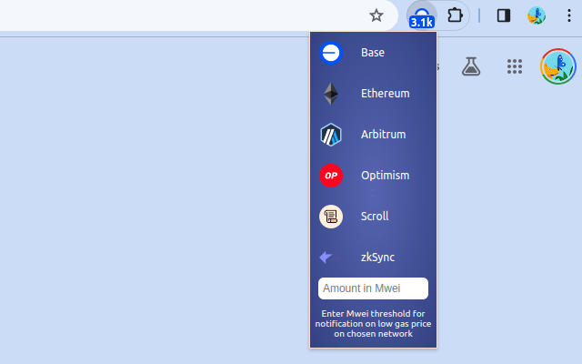
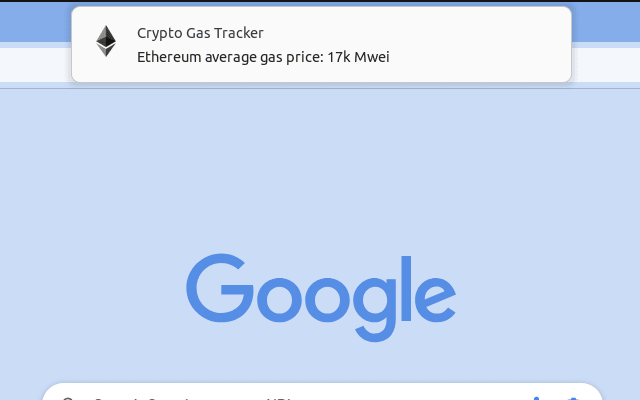

## Base Gas Price Tracker Extension

Displays recent gas prices of different networks at 10-minute intervals. Notifies when the gas price is below a set
threshold.
Fee volatility can swing from 400 to 37k Mwei in hours, that can be a difference of paying $0.05 or $50 for a swap.

So if you're not in a hurry, save on your onchain swaps and bridges! Optimize your transactions with low gas prices.

- Monitor recent gas prices across various ETH-based networks every 10 minutes.
- Receive notifications when gas prices dip below your set threshold.

I’ve powered this tool with the Etherscan API.

Looking for some specific feature or want to see more networks? Reach out to me on X: @Marty_cFly

  

  

  

## Extensions

Also check out my other Crypto Explorer Extension, 200+ daily users and 1000+ installs.
https://chromewebstore.google.com/detail/crypto-portfolio-blockcha/pkaheoacmbdgnemgmcdbekniooabcnmc?hl=en&authuser=0

## Contact

Looking for some specific feature? Reach out to me on X: @Marty_cFly

Linea
Scroll
Zksync
Blast

Manta
Mode

