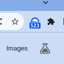

## Base Gas Price Tracker Extension

The Base Gas Price Tracker is a Chrome extension designed to provide real-time updates on Base gas prices directly
within your browser. Utilizing the BaseScan API, it fetches the latest base gas price information and displays it as a
badge on the extension icon. This tool is invaluable for Ethereum enthusiasts, traders, and developers who need to keep
an eye on gas prices for better transaction planning and cost estimation.

  

## Extensions

Also check out my other Crypto Explorer Extension, 150+ daily users and 650+ installs.
https://chromewebstore.google.com/detail/crypto-portfolio-blockcha/pkaheoacmbdgnemgmcdbekniooabcnmc?hl=en&authuser=0

## Contact

Looking for some specific feature? Reach out to me on X: @Marty_cFly

Linea
Scroll
Zksync
Blast

Manta
Mode

